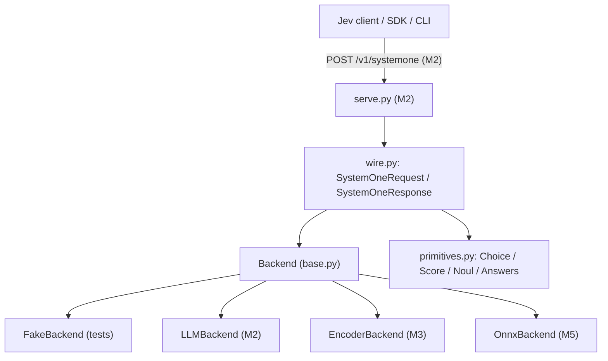

# Wire Contract & Primitives Design

**Spec:** `.specs/features/wire-contract/spec.md`
**Status:** Implemented

---

## Architecture Overview

The contract layer is the ground truth of Tachyone. `primitives.py` defines question/answer
types; `wire.py` defines the `/v1/systemone` envelope and delegates answering to a
`Backend`. A deterministic `FakeBackend` in tests exercises the whole cycle without a model.



---

## Components

### primitives.py

- **Purpose:** Define the three question primitives and their answer types with pydantic v2.
- **Location:** `src/tachyone/primitives.py`
- **Interfaces:**
  - `Question = NoulQuestion | ChoiceQuestion | ScoreQuestion` (discriminated union on `type`)
  - `ChoiceAnswer(type, choice, probabilities: dict[str, float], confidence: float)`
  - `ScoreAnswer(type, score, legend: dict[int, str], probabilities: dict[int, float], confidence: float)`
  - `NoulAnswer(type, noul: float)`
- **Constraints enforced:** choice options 1..255, score levels 2..10, probabilities keys
  match declared options/levels, probability values in [0,1].
- **Dependencies:** pydantic v2.
- **Reuses:** Nothing yet (greenfield).

### wire.py

- **Purpose:** Model and validate the Jev request/response envelope and map it to backends.
- **Location:** `src/tachyone/wire.py`
- **Interfaces:**
  - `SystemOneRequest(state: str | dict | list, model: str, questions: dict[str, Question])`
  - `SystemOneResponse(model: str, answers: dict[str, Answer], usage: Usage)`
  - `Usage(input_tokens: int, output_tokens: int)`
  - `async def answer(request, backend) -> SystemOneResponse`
- **Dependencies:** pydantic v2, `primitives`, `backends.base`.
- **Reuses:** Nothing yet.

### backends/base.py (seam)

- **Purpose:** Stable interface so `wire.py` never knows which engine answers.
- **Location:** `src/tachyone/backends/base.py`
- **Interfaces:**
  - `class Backend(Protocol): async def predict(self, questions, *, state, model, return_details=False) -> PredictionResult`
  - `PredictionResult(answers: dict[str, Answer], usage: Usage)`
- **Dependencies:** `primitives`.
- **Reuses:** Nothing yet.

---

## Data Models

```python
# Illustrative only — not production code. Mirrors docs/protocol.md.
class Usage(BaseModel):
    input_tokens: int
    output_tokens: int

class NoulCriteria(BaseModel):
    true: str | dict | list | None = None
    false: str | dict | list | None = None

class NoulQuestion(BaseModel):
    type: Literal["noul"] = "noul"
    instructions: str | dict | list
    criteria: NoulCriteria | None = None

class ChoiceQuestion(BaseModel):
    type: Literal["choice"] = "choice"
    instructions: str | dict | list
    criteria: dict[str, str | None]  # 1..255 entries

class ScoreQuestion(BaseModel):
    type: Literal["score"] = "score"
    instructions: str | dict | list
    criteria: list[str]  # 2..10 ordered levels
```

**Relationships:** `SystemOneRequest.questions` maps id → `Question`; `SystemOneResponse.answers`
maps the same id → `Answer`. `PredictionResult` carries both answers and `Usage` back to `wire.answer`.

---

## Error Handling Strategy

| Error Scenario | Handling | User Impact |
| --- | --- | --- |
| Unknown question `type` | pydantic discriminated-union error → 422 | Clear validation message |
| >255 choice options / <2 score levels | pydantic validator → 422 | Request rejected before backend |
| Missing/invalid API key | Server-level dependency → 401 | Client re-authenticates |
| Rate limit | Server returns 429; client SDK backs off | Transparent retry |
| Overload | Server returns 529; client SDK backs off | Transparent retry |
| Backend failure | Map to 500 with non-contract body (open decision OD-5) | Error surfaced |

---

## Tech Decisions (non-obvious)

| Decision | Choice | Rationale |
| --- | --- | --- |
| Validation library | pydantic v2 | Fast, first-class typing, JSON Schema export for `schemas.py` |
| Discriminated unions | `type` field discriminator | Matches Jev and gives precise 422 errors |
| Backend seam | `typing.Protocol`, async | No inheritance lock-in; supports sync encoders via adapter |
| Fake backend | First-class test double | Enables contract tests before any model exists |

---

## Open Questions

- **OD-5:** Should an empty `questions` map return `{}` answers or 422? Default plan: `{}`.
- **OD-1:** Backend method signature stability once LLM providers vary.
