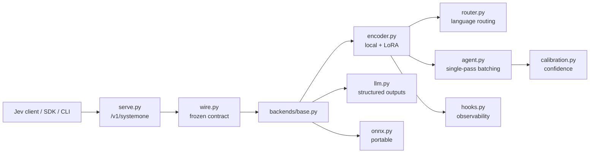

<p align="center">
  
</p>

# jeba

> **Local-first, multilingual System One decision engine that speaks the TypeSafe Jev `/v1/systemone` protocol.**

jeba answers atomic structured questions — `choice`, `score`, and `noul` — and returns typed
values with probabilities and calibrated confidence. Point an existing Jev client at a jeba
server and it works unchanged; run the local encoder backend for fully offline inference.

**Status: `v0.3.0` released.** All milestones M0–M6 are complete, plus the post-M6
**B-1 multilingual quality** work (localized data, per-`(primitive, language)` temperature, and a
multilingual LoRA raised to rank 64 — accuracy 0.702 → 0.853), **B-2 fast path** (per-shape CUDA
graphs with bf16 weights), **B-3 confidence thresholding / System-2 handoff**, and **B-4
input-noise robustness**. The wire contract, an OpenAI-compatible LLM backend, a local encoder
(ModernBERT/mmBERT + LoRA), an ONNX backend, FastAPI serving, an SDK/CLI, MCP + LangChain
integrations, a training pipeline, and a docs site all ship. LoRA adapters are published on the
Hugging Face Hub. See the
[CHANGELOG](CHANGELOG.md) for releases, next steps in
[`.specs/project/BACKLOG.md`](.specs/project/BACKLOG.md), and
[`.specs/project/STATE.md`](.specs/project/STATE.md) for decisions and blockers.

---

## Why jeba

Hosted decision APIs are fast but remote, closed, and metered; autoregressive LLMs are
local-capable but slow and poorly calibrated for atomic judgments. jeba sits in between:

- **Drop-in** — same request/response as Jev; repoint the client and keep your code.
- **Local-first** — the base install runs offline with no API key; the HTTP server is one mode, not the only one (the CLI's default backend is `llm`, so pass `--backend encoder` or `--backend fake` for a key-free run).
- **Fast** — the local backend is non-autoregressive: one forward pass, no decoding loop; `JEBA_FAST=1` adds a CUDA-graph path (2.7× p50 on an RTX 3060).
- **Calibrated** — probabilities trained with strictly proper scoring (RLCD) plus per-`(primitive, language)` temperature fitting.
- **Multilingual** — mmBERT-based checkpoint covering 100+ languages via automatic script/language routing.
- **Additive** — router control, hooks, `predict_batch`, MCP, and LangChain extend the contract without breaking it.

## How it compares

Mirrors the canonical table in [`docs/overview.md`](docs/overview.md#how-jeba-compares).

| | Jev | Laya | Needle | **jeba** |
| --- | --- | --- | --- | --- |
| Wire contract | `/v1/systemone` (hosted) | `/v1/systemone` (self-hosted) | Own tool/embedding API | **Jev-exact, self-hosted** |
| Hosted dependency | Required | None | None (device engine) | **None in core** |
| LLM backend | — | No (encoder only) | No | **Yes (optional)** |
| Encoder backend | Own model | Yes | Yes (2-bit) | **Yes (ModernBERT/mmBERT + LoRA)** |
| ONNX backend | No | Yes | Yes | **Yes (`onnx` extra)** |
| MCP / LangChain | No | Yes | No | **Yes** |
| Multilingual | Yes | Yes (mmBERT) | Partial | **Yes (100+ routed, 6 trained)** |
| Fast path | Proprietary | No | Quantized | **CUDA graphs (`fast` extra)** |
| Extension model | n/a | Router, hooks | Grammar, telemetry | **Router, hooks, batch (additive)** |
| License | Proprietary service | Apache-2.0 | Open | **Apache-2.0** |

## Install & quickstart

```bash
uv sync                 # core: offline, no key, no heavy deps
uv sync --extra serve   # + FastAPI server (+ integration/e2e test deps)

# Answer a question from the CLI (offline, model-free):
uv run jeba --predict --preset triage --backend fake "refund please"

# The local encoder (downloads base weights + LoRA adapters, needs the train extra):
uv sync --extra train
uv run jeba --predict --preset triage --backend encoder "Quero cancelar minha assinatura agora"

# Run the HTTP server:
uv run jeba-serve
```

```python
# Python SDK
from jeba import JebaClient
from jeba.primitives import ScoreQuestion

client = JebaClient("http://127.0.0.1:8000")
result = client.system_one(
    "This product is amazing!",
    {"sentiment": ScoreQuestion(
        instructions="Rate the sentiment.",
        criteria=["very negative", "negative", "neutral", "positive", "very positive"],
    )},
)
print(result.answers["sentiment"].score)
```

```bash
# Drop-in: point an existing Jev client at jeba
curl -s http://127.0.0.1:8000/v1/systemone \
  -H "Content-Type: application/json" \
  -d '{"state":"hello","model":"jeba-latest","questions":{"q":{"type":"noul","instructions":"Is this a greeting?"}}}'
```

## Local encoder & published models

`JEBA_BACKEND=encoder` (local, offline once cached) loads `answerdotai/ModernBERT-large` or
`jhu-clsp/mmBERT-base` and applies the published LoRA adapter. Override with
`JEBA_ADAPTERS="jeba-en=acme/tuned-en,jeba-multi="`; force cache-only with `JEBA_OFFLINE=1`.
On a CUDA device, `JEBA_FAST=1` opts into the per-shape CUDA-graph forward (bf16 weights) with
graceful fallback.

- Adapters: [`munod/jeba-en`](https://huggingface.co/munod/jeba-en) ·
  [`munod/jeba-multi`](https://huggingface.co/munod/jeba-multi)
- Measured on a single RTX 3060 12GB (full tables: [`benchmarks/report.md`](benchmarks/report.md)):

  | Checkpoint | Overall | `choice` | `noul` | `score` | ECE |
  | --- | --- | --- | --- | --- | --- |
  | English (ModernBERT-large + LoRA r=16 + choice head) | 0.763 | 0.834 | 0.744 | 0.712 | 0.061 |
  | Multilingual (mmBERT-base + LoRA r=64 + choice head) | 0.853 | 0.684 | 0.960 | 0.916 | 0.038 |

  The dedicated `choice` head (L-002) and localized per-record-RNG data (B-1) lifted multilingual
  `choice` from ~0.25 (chance), and raising the multilingual LoRA rank to 64 lifted overall
  accuracy to 0.853 and cut `es` ECE to 0.038 (two of six languages now meet ECE ≤ 0.05 — `es`
  0.038 and `pt` 0.024; `de` 0.063, `fr` 0.051, `it` 0.059 and `nl` 0.104 remain above target). The
  CUDA-graph fast path (`JEBA_FAST=1`) improves p50 10.3 → 3.8 ms with no top-label
  changes.

## Architecture at a glance



Full detail: [`docs/architecture.md`](docs/architecture.md) · Contract: [`docs/protocol.md`](docs/protocol.md).

## Quality gates

```bash
uv run ruff check .
uv run ruff format --check .
uv run pyright
uv run pytest                       # contract + unit + integration + e2e
uv run mkdocs build --strict        # docs site (uv sync --group docs)
```

## Roadmap

| Phase | Milestone | Status |
| --- | --- | --- |
| M0 | Bootstrap | ✅ |
| M1 | Wire Contract | ✅ |
| M2 | LLM Backend + Serve | ✅ |
| M3 | Local Encoder | ✅ |
| M4 | Training & Calibration | ✅ |
| M5 | Ecosystem & Acceleration | ✅ |
| M6 | Proof & Release | ✅ (`v0.1.0`) |
| B-1 | Multilingual quality + per-language temperature | ✅ (`v0.2.0`) |
| B-2 | Fast path (CUDA graphs) | ✅ (`v0.2.0`) |
| B-3 | Confidence thresholding / System-2 handoff | ✅ (`v0.3.0`) |
| B-4 | Input-noise robustness + clean/noisy split | ✅ (`v0.3.0`) |
| — | Multilingual LoRA rank 16 → 64 | ✅ (`v0.3.0`) |

Details: [`docs/roadmap.md`](docs/roadmap.md) · Tasks: [`docs/tasks.md`](docs/tasks.md).

## Documentation map

| Doc | Contents |
| --- | --- |
| [`docs/overview.md`](docs/overview.md) | Vision, personas, use cases, success metrics, non-goals |
| [`docs/protocol.md`](docs/protocol.md) | The `/v1/systemone` contract |
| [`docs/architecture.md`](docs/architecture.md) | Components, flows, backend strategy, hooks |
| [`docs/cli.md`](docs/cli.md) | CLI flags, presets, modes, exit codes |
| [`docs/mcp.md`](docs/mcp.md) | MCP stdio server (`jeba-mcp-server`) |
| [`docs/langchain.md`](docs/langchain.md) | LangChain/LangGraph `Runnable` adapter |
| [`docs/docker.md`](docs/docker.md) | Image, Compose, healthcheck, config in containers |
| [`docs/cookbook-handoff.md`](docs/cookbook-handoff.md) | Confidence thresholding + System-2 handoff |
| [`docs/benchmarks.md`](docs/benchmarks.md) | Accuracy/ECE/latency numbers and limitations |
| [`docs/roadmap.md`](docs/roadmap.md) | Milestones, exit criteria, backlog |
| [`docs/tasks.md`](docs/tasks.md) | Atomic task plan (M0–M6) |
| [`docs/adr/`](docs/adr/) | Architecture decision records |
| [`docs/requirements/`](docs/requirements/) | Functional, non-functional, traceability |
| [`docs/testing.md`](docs/testing.md) | Contract/parity tests, gates, benchmarks |
| [`docs/training.md`](docs/training.md) | Data generation, LoRA/QLoRA, RLCD, calibration |
| [`docs/huggingface.md`](docs/huggingface.md) | Publishing and loading adapters |
| [`docs/release.md`](docs/release.md) | Release checklist |
| [`docs/model-card.md`](docs/model-card.md) | Hugging Face model card |
| [`benchmarks/report.md`](benchmarks/report.md) | Reproducible benchmark report |
| [`CHANGELOG.md`](CHANGELOG.md) | Notable changes (Keep a Changelog) |
| [`CONTRIBUTING.md`](CONTRIBUTING.md) | Conventions, gates, contract-test rule |

## Contributing

See [`CONTRIBUTING.md`](CONTRIBUTING.md). Short version: conventional commits, one logical
change per commit, English docs/PRs, and **any public API change must update the contract test
in the same commit**.

## License

[Apache-2.0](LICENSE).
