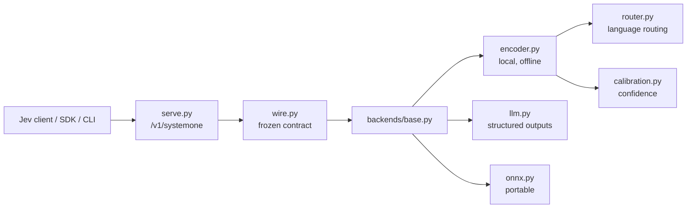

# jeba

> **Local-first, multilingual decision engine that speaks the TypeSafe Jev `/v1/systemone` protocol.**

jeba answers atomic structured questions — `choice`, `score`, and `noul` — in a single forward
pass, on your own hardware, with calibrated confidence. Point an existing Jev client at a jeba
server and it just works.

**Status: pre-implementation.** This repository currently contains **documentation only** — no
`src/` code, no `pyproject.toml`, no tests. Everything below describes the intended system.
See [`.specs/project/STATE.md`](.specs/project/STATE.md) for the decision log.

---

## Why jeba

Hosted decision APIs are fast but remote, closed, and metered. Autoregressive LLMs are
local-capable but slow and poorly calibrated for atomic judgments. jeba sits in between:

- **Drop-in** — same request/response as Jev; repoint the client, keep the code.
- **Local-first** — the base install runs offline with no API key; the HTTP server is one mode, not the only one.
- **Fast** — the local backend is non-autoregressive: one forward pass, no decoding loop.
- **Calibrated** — probabilities trained with strictly proper scoring (RLCD) + temperature fitting.
- **Multilingual** — mmBERT-based checkpoint covering 100+ languages via automatic script/language routing.
- **Additive** — router control, hooks, and `predict_batch` extend the contract without breaking it.

## How it compares

| | Jev | Laya | Needle | **jeba** |
| --- | --- | --- | --- | --- |
| Wire contract | `/v1/systemone` (hosted) | `/v1/systemone` (self-hosted) | Own API | **Jev-exact, self-hosted** |
| Hosted dependency | Required | None | None | **None in core** |
| LLM backend | — | No | No | **Yes (Phase 2, optional)** |
| Encoder backend | Own model | Yes | Yes (2-bit) | **Phase 3 (ModernBERT/mmBERT)** |
| Multilingual | Yes | Yes | Partial | **Yes (100+ languages)** |
| License | Proprietary service | Apache-2.0 | Open | **Apache-2.0** |

## Conceptual quickstart

> These commands are **planned** and do not work yet. They describe the intended interface.

```bash
# Install (planned)
uv add jeba            # core: offline, no key
uv add "jeba[serve]"   # + HTTP server
uv add "jeba[train]"   # + training stack

# Answer a question from the CLI (planned)
jeba "This product is amazing!" --preset triage --predict

# Run the server (planned)
jeba-serve
```

```python
# Python SDK (planned, illustrative)
from jeba import Client

client = Client(base_url="http://127.0.0.1:8000")
result = client.systemone(
    state="This product is amazing!",
    model="jeba-latest",
    questions={
        "sentiment": {
            "type": "score",
            "instructions": "Rate the sentiment.",
            "criteria": ["very negative", "negative", "neutral", "positive", "very positive"],
        }
    },
)
print(result.answers["sentiment"])
```

```bash
# Drop-in: point an existing Jev client at jeba (planned)
curl -s http://127.0.0.1:8000/v1/systemone \
  -H "Authorization: Bearer $JEBA_API_KEY" \
  -H "Content-Type: application/json" \
  -d '{"state":"hello","model":"jeba-latest","questions":{"q":{"type":"noul","instructions":"Is this a greeting?"}}}'
```

## Architecture at a glance



Full detail: [`docs/architecture.md`](docs/architecture.md) · Contract: [`docs/protocol.md`](docs/protocol.md).

## Roadmap

| Phase | Milestone | Outcome |
| --- | --- | --- |
| M0 | Bootstrap | Python 3.12 + uv project, ruff/pyright/pytest, CI, license |
| M1 | Wire Contract | Frozen primitives + Jev-exact wire + golden contract tests |
| M2 | LLM Backend + Serve | Working server, SDK, CLI; repointed Jev client |
| M3 | Local Encoder | Offline single-pass backend, router, calibrated confidence |
| M4 | Training & Calibration | Data generation, LoRA/QLoRA, RLCD, ECE fitting |
| M5 | Ecosystem | ONNX/fast path, MCP, LangChain, Docker |
| M6 | Proof & Release | Benchmarks, docs site, Hugging Face release |

Details: [`docs/roadmap.md`](docs/roadmap.md) · Tasks: [`docs/tasks.md`](docs/tasks.md).

## Documentation map

| Doc | Contents |
| --- | --- |
| [`docs/overview.md`](docs/overview.md) | Vision, personas, use cases, success metrics, non-goals |
| [`docs/roadmap.md`](docs/roadmap.md) | Phases, milestones, exit criteria |
| [`docs/requirements/functional.md`](docs/requirements/functional.md) | Functional requirements with IDs |
| [`docs/requirements/non-functional.md`](docs/requirements/non-functional.md) | Non-functional requirements with IDs |
| [`docs/requirements/traceability.md`](docs/requirements/traceability.md) | Requirement → design → task matrix |
| [`docs/protocol.md`](docs/protocol.md) | The `/v1/systemone` contract |
| [`docs/architecture.md`](docs/architecture.md) | Components, flows, backend strategy, hooks |
| [`docs/adr/`](docs/adr/) | Architecture decision records |
| [`docs/tasks.md`](docs/tasks.md) | Atomic task plan with verification |
| [`docs/testing.md`](docs/testing.md) | Contract/parity tests, gates, benchmarks |
| [`docs/training.md`](docs/training.md) | Data generation, LoRA/QLoRA, RLCD, calibration |
| [`CONTRIBUTING.md`](CONTRIBUTING.md) | Conventions, gates, contract-test rule |

## Contributing

See [`CONTRIBUTING.md`](CONTRIBUTING.md). Short version: conventional commits, one logical
change per commit, English docs/PRs, and **any public API change must update the contract test
in the same commit**.

## License

[Apache-2.0](LICENSE).