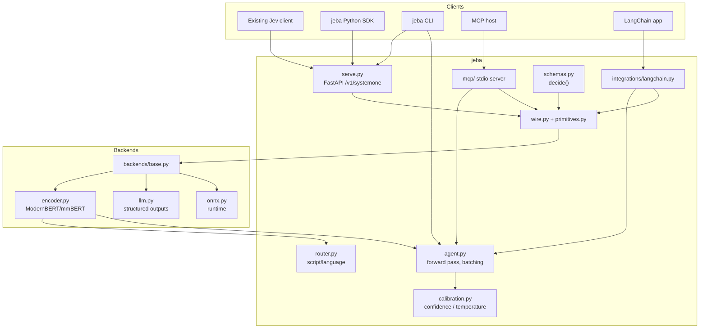
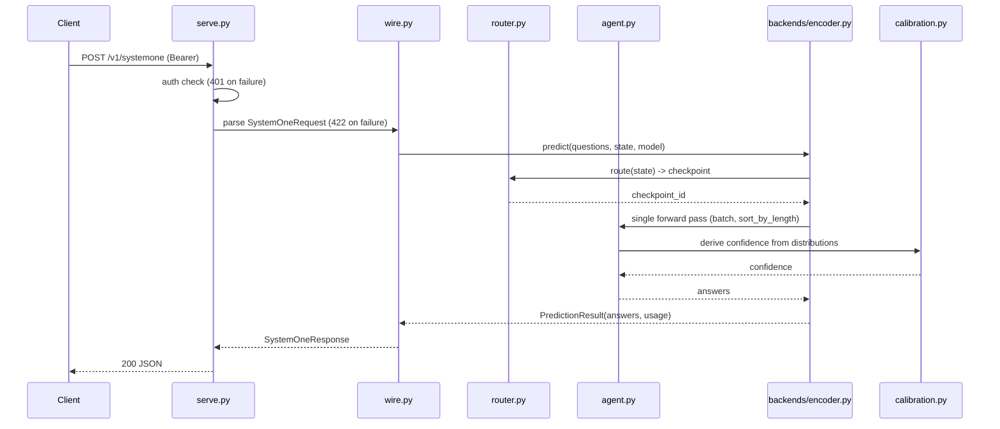
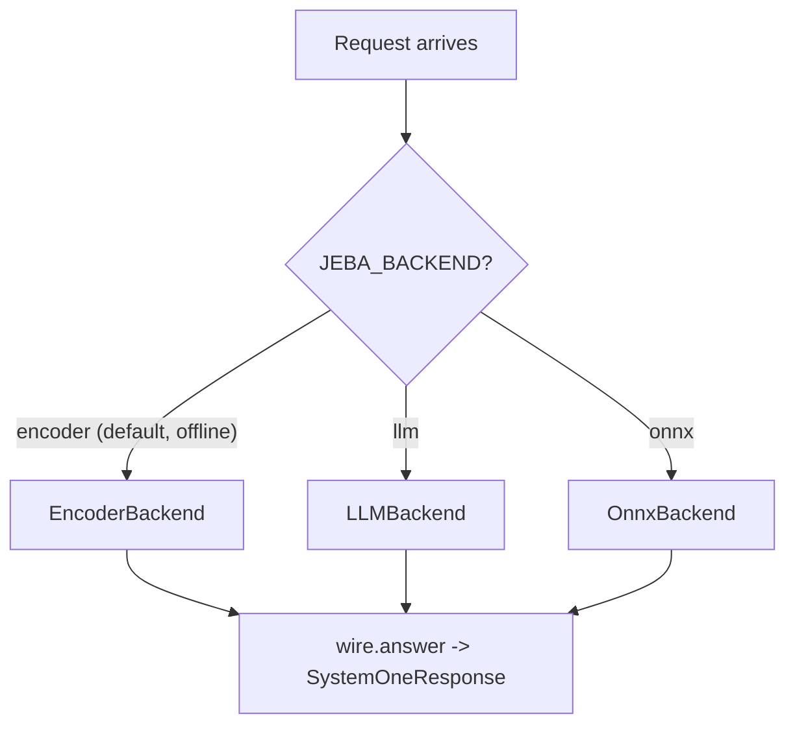

# Architecture

**Status:** Design (approved decisions locked; open items flagged).
**Related:** `docs/protocol.md`, `docs/adr/`, `docs/requirements/`, `docs/training.md`.

This document defines **how jeba is built**. It is organized around one hard boundary —
the frozen wire — and one flexible seam — the pluggable backend.

---

## Architectural principles

1. **Contract-first.** `wire.py` + `docs/protocol.md` are frozen before backends exist.
   Backends are interchangeable behind the seam; the wire never depends on which one runs.
2. **Local-first, offline-capable core.** Base install must answer with no network and no
   API key. Heavy/optional dependencies live behind pip extras.
3. **Additive extensions only.** Router control, hooks, batching, integrations never mutate
   the canonical request/response shape.
4. **Single forward pass where possible.** The local backend answers all primitives without
   autoregressive decoding; batching and length-sorting keep latency low.
5. **Calibration is a feature.** `confidence` is derived from calibrated distributions, not
   asserted; training optimizes strictly proper scoring rules.
6. **One logical change per commit; public API changes update the contract test in the same commit.**

---

## System context



---

## Planned repository structure

```text
projeto_jeba/
├── pyproject.toml            # uv project, py>=3.12,<3.13, extras, entry points
├── uv.lock                   # committed lockfile
├── .python-version           # 3.12
├── AGENTS.md  README.md  CONTRIBUTING.md  LICENSE (Apache-2.0)
├── src/jeba/
│   ├── __init__.py           # public SDK surface
│   ├── primitives.py         # Choice / Score / Noul + Answer models (pydantic v2)
│   ├── wire.py               # /v1/systemone request/response + error mapping
│   ├── agent.py              # single forward pass, batching, sort_by_length
│   ├── router.py             # script/language → checkpoint selection + lifecycle
│   ├── calibration.py        # confidence derivation + temperature fitting
│   ├── schemas.py            # JSON Schema / pydantic → questions (decide())
│   ├── cli.py                # `jeba` entry point + presets
│   ├── serve.py              # FastAPI: /v1/systemone, /predict, /predict/batch, /health
│   ├── config.py             # env-var configuration + validation
│   ├── backends/
│   │   ├── base.py           # Backend Protocol + PredictionResult
│   │   ├── encoder.py        # local ModernBERT/mmBERT + 3 heads
│   │   ├── llm.py            # structured outputs of existing LLMs
│   │   └── onnx.py           # onnxruntime backend
│   ├── mcp/                  # stdio MCP server (`jeba-mcp-server`)
│   └── integrations/
│       └── langchain.py      # Runnable adapter
├── training/
│   ├── generate_data.py      # synthetic JSONL generation
│   ├── finetune_rlcd.py      # LoRA/QLoRA + RLCD proper scoring
│   └── fit_calibration.py    # temperature / ECE fitting
├── tests/                    # contract, unit, integration, conditional-by-extra
├── benchmarks/               # MASSIVE / XNLI / typed-decisions harness
├── examples/                 # runnable examples (added at implementation time)
├── docker/                   # Dockerfile + compose
└── .github/workflows/ci.yml  # ruff + pyright + pytest
```

**pip extras:** `serve`, `fast`, `onnx`, `langchain`, `mcp`, `train`.
**Entry points:** `jeba`, `jeba-serve`, `jeba-mcp-server`.

---

## Components

### `primitives.py`

- **Purpose:** Canonical pydantic v2 models for the three primitives and their answers.
- **Location:** `src/jeba/primitives.py`
- **Interfaces:**
  - `NoulQuestion`, `ChoiceQuestion`, `ScoreQuestion` (discriminated union `Question` on `type`)
  - `NoulAnswer`, `ChoiceAnswer`, `ScoreAnswer` (discriminated union `Answer`)
  - validators: choice 1..255 options, score 2..10 levels, probability key coverage.
- **Dependencies:** pydantic v2 only.
- **Boundary:** Pure data + validation. No I/O, no model knowledge.

### `wire.py`

- **Purpose:** Envelope models, backend dispatch, and error mapping for `/v1/systemone`.
- **Location:** `src/jeba/wire.py`
- **Interfaces:**
  - `SystemOneRequest`, `SystemOneResponse`, `Usage`
  - `answer(request: SystemOneRequest, backend: Backend) -> SystemOneResponse`
  - error constructors for 401/422/429/529.
- **Dependencies:** `primitives`, `backends.base`.
- **Boundary:** Knows the contract, not the engine.

### `backends/base.py` (the seam)

- **Purpose:** Stable interface every engine implements.
- **Location:** `src/jeba/backends/base.py`
- **Interfaces:**
  - `class Backend(Protocol):` `async def predict(self, questions, *, state, model, return_details=False) -> PredictionResult`
  - `PredictionResult(answers: dict[str, Answer], usage: Usage)`
- **Dependencies:** `primitives`.
- **Boundary:** The only thing `wire.py` couples to. Swap implementations freely.

### `backends/llm.py` (Phase 2)

- **Purpose:** Answer primitives via structured outputs of existing LLMs.
- **Location:** `src/jeba/backends/llm.py`
- **Interfaces:** implements `Backend`; provider selection via config.
- **Dependencies:** optional extra (provider SDK/HTTP client).
- **Boundary:** Never required by core; no key/network needed unless selected.
- **Open:** OD-1 provider abstraction surface.

### `backends/encoder.py` + `agent.py` (Phase 3)

- **Purpose:** Local single-forward-pass inference with three task heads.
- **Location:** `src/jeba/backends/encoder.py`, `src/jeba/agent.py`
- **Interfaces:**
  - `Agent.predict_batch(states, questions, *, sort_by_length=True)`
  - `Agent.preload(checkpoints)`, `Agent.unload(checkpoint)`
  - `EncoderBackend` implements `Backend`.
- **Dependencies:** torch/transformers, `router`, `calibration`, `agent`.
- **Reuses:** `router.py` for checkpoint choice; `calibration.py` for confidence.

### `router.py` (Phase 3)

- **Purpose:** Detect script/language and select the right checkpoint; manage lifecycle.
- **Location:** `src/jeba/router.py`
- **Interfaces:**
  - `Router.route(text) -> checkpoint_id` (target overhead < 0.5 ms)
  - `Router.preload(...)`, `Router.attach(...)`, `Router.unload(...)`, `max_loaded`
- **Dependencies:** lightweight detection only (no model inference).
- **Boundary:** Routing decisions never change the wire shape.

### `calibration.py` (Phase 3–4)

- **Purpose:** Derive `confidence` from distributions; fit temperature to minimize ECE.
- **Location:** `src/jeba/calibration.py`
- **Interfaces:**
  - `confidence(probabilities) -> float`
  - `fit_temperature(logits, labels) -> Temperature`
  - `apply_temperature(probabilities, temperature) -> probabilities`
- **Dependencies:** numpy/torch (extra `train`), pure-python fallback for the function itself.

### `schemas.py`

- **Purpose:** Turn JSON Schema / pydantic models into decision primitives.
- **Location:** `src/jeba/schemas.py`
- **Interfaces:** `decide(schema, *, return_details=False) -> questions | result`.
- **Dependencies:** pydantic; JSON Schema parsing.
- **Reuses:** `primitives.py`.

### `serve.py`

- **Purpose:** HTTP surface.
- **Location:** `src/jeba/serve.py`
- **Interfaces:**
  - `POST /v1/systemone` (canonical)
  - `POST /predict`, `POST /predict/batch`, `GET /health` (extensions)
- **Dependencies:** optional extra `serve` (FastAPI + uvicorn).
- **Boundary:** Transport + auth; delegates to `wire.answer`.

### `mcp/` and `integrations/langchain.py` (Phase 5)

- **Purpose:** Agent-framework integration.
- **Interfaces:** MCP stdio tools; LangChain `Runnable`.
- **Dependencies:** extras `mcp`, `langchain`.

### `cli.py`

- **Purpose:** `jeba "text" --preset triage --predict` and `--serve`.
- **Interfaces:** presets `router`, `guard`, `moderation`, `triage`, `email`.
- **Dependencies:** argparse/typer (decided at M0); core.

### `config.py`

- **Purpose:** Env-var configuration, single source of truth.
- **Interface (env vars):** `JEBA_HOST`, `JEBA_PORT`, `JEBA_DEVICE`, `JEBA_PRELOAD`,
  `JEBA_MODELS`, `JEBA_THREADS`, `JEBA_API_KEY`, `JEBA_BACKEND`.
- **Boundary:** Never logs secrets; validates at startup.

---

## Execution flows

### Canonical request (encoder backend)



### Backend selection



All three paths must pass the same contract tests. The wire output is identical in shape.

---

## Data models

The wire models are specified in `docs/protocol.md`. Internally:

```python
# Illustrative only.
class PredictionResult(BaseModel):
    answers: dict[str, Answer]
    usage: Usage

class CheckpointInfo(BaseModel):
    id: str                 # e.g. "jeba-en", "jeba-multi"
    languages: list[str]    # ["en"] or ["*"] for multilingual
    context: int
    size_params: int

class RouteDecision(BaseModel):
    checkpoint_id: str
    detected_script: str
    detected_language: str | None
```

---

## Backend strategy (decided)

| Phase | Backend | Role | Offline? |
| --- | --- | --- | --- |
| M2 | `llm.py` | Fast end-to-end, structured outputs | No (unless local provider) |
| M3 | `encoder.py` | Default local single-pass engine | Yes |
| M5 | `onnx.py` | Portable/accelerated runtime | Yes |

The seam is `backends/base.py`. Adding a backend must not change `wire.py` or `docs/protocol.md`.
See `docs/adr/ADR-0002-pluggable-backend-phasing.md`.

---

## Routing & multilingual strategy (decided)

- Detect script/language cheaply (no model forward pass), target overhead < 0.5 ms.
- Select English (`ModernBERT-large`-class) vs multilingual (`mmBERT-base`, 100+ languages).
- Lifecycle: `preload`, `max_loaded`, LRU `evict`, `unload`, `attach`.
- Fallback to multilingual when language is uncertain.
- Router decisions are exposed via hooks and optional extension fields, never in the canonical answer.

---

## Calibration & confidence (decided)

- Training uses **RLCD** against strictly proper scoring rules → calibrated probabilities.
- `confidence` for `choice`/`score` is a monotone function of the distribution (typically the
  selected mass). `noul` returns a single probability with no separate confidence.
- Temperature fitting minimizes ECE on a held-out calibration split.
- `return_details=True` exposes full probabilities as an additive extension.
- ECE target and method: `docs/training.md`.

---

## Hooks (additive extension)

Signature pattern: a callable or object registered for lifecycle events.

| Hook | Fires when |
| --- | --- |
| `on_predict_start` | Before inference for a request |
| `on_predict_end` | After inference completes |
| `on_route` | After a routing decision |
| `on_load` | A checkpoint is loaded |
| `on_evict` | A checkpoint is evicted |
| `on_error` | An error occurs during inference |

**Rule:** hooks may observe and log; they must not alter the canonical `/v1/systemone` shape.
A raising hook triggers `on_error` and serving continues. This mirrors Laya's public-API
contract (`tests/test_hooks_api.py` in Laya is the inspiration for jeba's hook contract test).

---

## Error handling strategy

| Scenario | Handling | Wire impact |
| --- | --- | --- |
| Invalid key | auth dependency | 401 |
| Malformed body | pydantic validation | 422 |
| Too many options / bad levels | primitive validators | 422 |
| Rate limit | server returns 429; SDK backs off | 429 |
| Overload | server returns 529; SDK backs off | 529 |
| Backend/internal failure | log + non-contract 500 body | 500 (open shape, OD-5) |
| Hook raises | `on_error`, continue | none |
| Extra missing | import-guard with actionable message | runtime error naming extra |

---

## Configuration

All configuration via environment variables (prefix `JEBA_`), documented in `config.py`:

| Var | Default | Purpose |
| --- | --- | --- |
| `JEBA_HOST` | `127.0.0.1` | Server bind host |
| `JEBA_PORT` | `8000` | Server port |
| `JEBA_DEVICE` | `auto` | `cpu` / `cuda` / `auto` |
| `JEBA_BACKEND` | `encoder` | `encoder` / `llm` / `onnx` |
| `JEBA_MODELS` | built-in ids | Available checkpoints |
| `JEBA_PRELOAD` | empty | Checkpoints to load at startup |
| `JEBA_THREADS` | auto | CPU thread budget |
| `JEBA_API_KEY` | unset | Enables Bearer auth; unset = auth disabled (dev only) |

No secrets are committed to the repository.

---

## Decisions vs open questions

**Decided (locked):** Jev drop-in; pluggable backend + phase order; multilingual mmBERT from M3;
local-first/offline core; Apache-2.0 + opt-out telemetry; Python 3.12 + uv.

**Open:** OD-1 LLM provider surface · OD-2 telemetry default · OD-3 weights distribution ·
OD-4 ONNX vs TileLang sequencing · OD-5 non-contract extension/500 schema.
